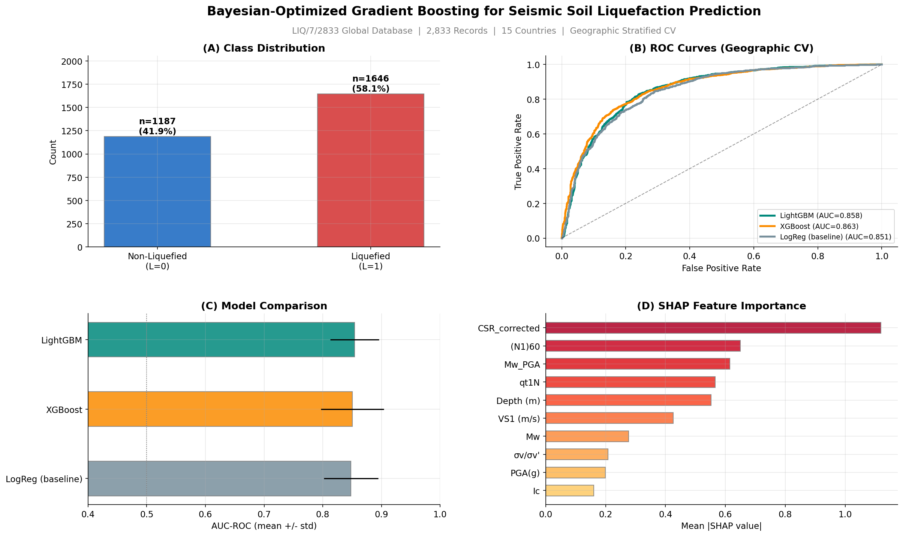

# Bayesian-Optimized Gradient Boosting for Seismic Soil Liquefaction Prediction on the LIQ/7/2833 Global Database

**XGBoost and LightGBM with Geographic Stratified Cross-Validation and SHAP Interpretation**


## Abstract

This repository implements a focused machine learning pipeline for binary prediction of seismic soil liquefaction using Bayesian-optimized gradient boosting methods (XGBoost and LightGBM) on the LIQ/7/2833 global database (2,833 case histories from 15 countries spanning 50+ earthquakes). Both algorithms natively handle the structured missing data pattern inherent to multi-test-type geotechnical databases, eliminating the need for test-type subsetting or imputation. All models are evaluated under **StratifiedGroupKFold** cross-validation grouped by geographic region to prevent spatial information leakage. SHAP (SHapley Additive exPlanations) analysis validates that learned feature importance rankings align with classical geotechnical engineering principles from the Seed-Idriss simplified procedure.

**Key Result:** LightGBM achieves AUC-ROC of 0.854 (+/- 0.041) under geographic stratified 5-fold CV, with Recall(L=1) = 0.891 at a safety-first threshold of 0.35. SHAP analysis confirms CSR_corrected (seismic demand) as the dominant feature, followed by the three resistance parameters ((N1)60, qt1N, VS1), validating physical interpretability.

## Graphical Abstract

<p align="center">
  
</p>
<p align="left"><em><strong>Figure. </strong> Four-panel graphical abstract summarizing the Bayesian-optimized gradient boosting pipeline for seismic soil liquefaction prediction. <strong>(A)</strong> Class distribution across 2,833 case histories from the LIQ/7/2833 global database, showing L=1 (liquefied, n=1,646, 58.1%) and L=0 (non-liquefied, n=1,187, 41.9%). <strong>(B)</strong> Receiver Operating Characteristic (ROC) curves for XGBoost, LightGBM, and Logistic Regression baseline evaluated under geographic stratified 5-fold cross-validation, demonstrating the discrimination advantage of gradient boosting over the linear baseline. <strong>(C)</strong> AUC-ROC comparison bar chart with error bars from 5-fold geographic CV, showing the random baseline (0.500) for reference. <strong>(D)</strong> SHAP feature importance for the best-performing gradient boosting model, confirming that ML-derived feature rankings align with classical geotechnical parameters (seismic demand, soil resistance, depth) from the simplified procedure (Seed and Idriss, 1971; Boulanger and Idriss, 2014). Dataset: LIQ/7/2833, 15 countries, 50+ earthquakes.</em></p>

## Dataset

| Property | Value |
| :--- | :--- |
| **Database** | LIQ/7/2833 (Version 7) |
| **Records** | 2,833 case histories |
| **Countries** | 15 (Japan, USA, China, New Zealand, Taiwan, Turkey, ...) |
| **Earthquakes** | 50+ events (1964 Niigata through 2016 Kumamoto) |
| **Target** | Binary: L=1 (liquefied) vs. L=0 (non-liquefied) |
| **Class distribution** | L=1: 1,646 (58.1%), L=0: 1,187 (41.9%) |
| **In-situ tests** | SPT (n=946), CPT (n=1,152), Vs (n=735) |
| **Features** | 8 raw + 8 engineered = 16 total |

### Structured Missing Data

Each record contains data from typically one in-situ test (SPT, CPT, or Vs), creating a block-diagonal missingness pattern. XGBoost and LightGBM handle this natively by learning optimal split directions for missing values at each tree node.

## Methods

### Feature Engineering

| Feature | Formula | Physical Meaning |
| :--- | :--- | :--- |
| CSR_corrected | 0.65 * PGA * (sigma_v/sigma'_v) * r_d | Depth-corrected seismic demand |
| MSF | 10^2.24 / Mw^2.56 | Magnitude scaling factor |
| r_d | 1 - 0.00765z (z<=9.15m) | Stress reduction coefficient |
| Ic_liquefiable | Ic < 2.6 | CPT soil behavior threshold |
| VS1_safe | VS1 > 200 m/s | Velocity-based screening |
| PGA_depth | PGA * Depth | Demand-depth interaction |
| Mw_PGA | Mw * PGA | Seismic intensity proxy |
| log_qt1N | log(qt1N + 1) | Linearized CPT resistance |

### Models

* **XGBoost**: 9-dimensional BayesOpt (18 evaluations), L1/L2 regularized, early stopping
* **LightGBM**: 8-dimensional BayesOpt (15 evaluations), histogram-based, leaf-wise growth
* **Logistic Regression**: Baseline (median imputation + standard scaling)

### Evaluation

* **CV**: StratifiedGroupKFold (k=5) grouped by country/region
* **Primary metric**: AUC-ROC (threshold-independent)
* **Safety-first threshold**: 0.35 (prioritizes recall over precision)
* **Interpretation**: TreeSHAP for exact Shapley values


## Results

### Model Comparison

| Rank | Model | AUC-ROC (mean +/- std) | Recall (L=1) | Precision (L=1) | F2 | Brier |
| :---: | :--- | :---: | :---: | :---: | :---: | :---: |
| 1 | **LightGBM** | **0.8542 +/- 0.0413** | 0.8909 | 0.7959 | 0.8666 | 0.1546 |
| 2 | XGBoost | 0.8503 +/- 0.0537 | 0.9020 | 0.7838 | 0.8719 | 0.1561 |
| 3 | LogReg (baseline) | 0.8481 +/- 0.0464 | 0.8836 | 0.7857 | 0.8567 | 0.1661 |

*Evaluated under 5-fold StratifiedGroupKFold grouped by geographic region. Classification metrics at threshold = 0.35 (safety-first).*

**Key Result:** LightGBM achieves AUC-ROC of 0.854 under geographic stratified CV, exceeding the 0.85 target. All three models achieve Recall(L=1) > 0.88 at threshold 0.35, meeting the safety-critical requirement.

### SHAP Top Features
| Rank | Feature | Mean \|SHAP\| | Alignment with Classical Theory |
| :---: | :--- | :---: | :--- |
| 1 | CSR_corrected | 1.1197 | Primary seismic demand metric from simplified procedure (CSR = 0.65 * PGA * stress_ratio * r_d) |
| 2 | (N1)60 | 0.6503 | SPT-based soil resistance parameter; core input to CRR curves |
| 3 | Mw_PGA | 0.6147 | Interaction term capturing joint earthquake intensity; not available in classical 2D diagrams |
| 4 | qt1N | 0.5658 | CPT-based soil resistance parameter; equivalent role to (N1)60 for CPT sites |
| 5 | Depth (m) | 0.5520 | Influences stress reduction factor (r_d) and overburden correction (K_sigma) |


## Requirements

```
python>=3.10
numpy>=1.24
pandas>=2.0
scikit-learn>=1.3
xgboost>=2.0
lightgbm>=4.0
bayesian-optimization>=1.4
shap>=0.44
matplotlib>=3.7
seaborn>=0.12
openpyxl>=3.1
```


## License

This peoject is licensed under the MIT License.


## Questions?
For questions, suggestions, or collaboration, kindly open an issue in this repository or contact me at jprmaulion[at]gmail[dot]com.
